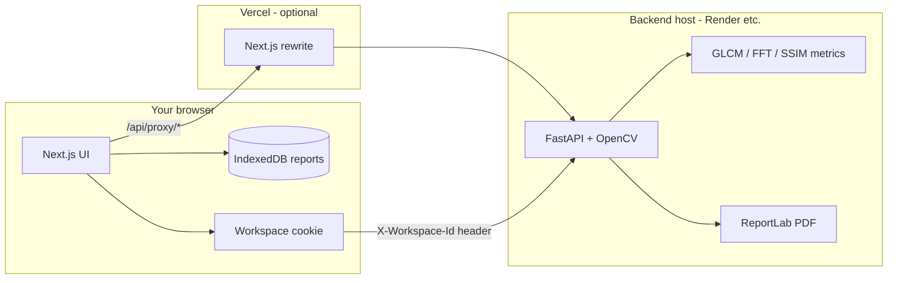

# Inspectra AI — Version 0.001

**Inspectra AI** analyzes textile and cotton fabric images using **classical computer vision** (no training, no cloud ML models). It produces lab-style metric reports, multi-sample batch comparison, and downloadable PDF/CSV exports. Each user gets a **private browser workspace** so reports are not mixed between visitors.

Repository: [github.com/vvsrinath/Inspectra-AI-Version-0.001](https://github.com/vvsrinath/Inspectra-AI-Version-0.001)

---

## How it works



### User flow

1. **Home** — Choose single-sample **Analyze** or multi-sample **Compare** (2–10 images).
2. **Upload** — Images are sent to the API; processing runs **in memory** on the server (not stored permanently on disk).
3. **Metrics** — The backend computes scores such as SSIM, texture (GLCM), weave (FFT), sharpness, stains, quality grade, etc.
4. **Results** — Tables and explanations appear in the UI; data is saved in **your browser’s IndexedDB** under your anonymous workspace ID.
5. **Export** — Download a lab PDF or CSV from the results or compare page.

### Privacy model

- A random **workspace ID** is stored in a cookie / localStorage.
- Every API request sends `X-Workspace-Id` so the server can scope logic if needed.
- **Report history** lives in **IndexedDB on your device**, not in a shared database—similar in spirit to “your own lab bench,” not a multi-tenant cloud account (MVP).

### What is *not* used

- No TensorFlow / PyTorch / Gemini / OpenAI for analysis.
- Classical OpenCV + scikit-image pipelines only.

---

## Tech stack

| Layer | Technology |
|--------|------------|
| Frontend | Next.js 16, React 19, Tailwind CSS 4 |
| Backend | FastAPI, OpenCV, scikit-image, ReportLab |
| Local run | `start.bat` → uvicorn `:8000` + `npm run dev` `:3000` |
| Production (all-in-one) | **Vercel** — UI + Python API ([DEPLOY_VERCEL.md](./DEPLOY_VERCEL.md)) |
| Production (split) | **Vercel** UI + **Render** API ([DEPLOY_RENDER.md](./DEPLOY_RENDER.md)) |

---

## Project structure

```
Inspectra-AI-Version-0.001/
├── backend/                 # FastAPI API
│   ├── api/router.py        # /analyze-material, /compare-batch, PDF, CSV
│   ├── services/              # MaterialAnalyzer, batch statistics
│   ├── reports/               # TTDC-style PDF generator
│   └── requirements.txt
├── frontend/                # Next.js app (deploy this to Vercel)
│   ├── src/app/             # Pages: /, /analyze, /compare, /dashboard, /results
│   ├── src/lib/api.ts       # API client + downloads
│   └── public/logo.svg      # App logo & favicon
├── render.yaml              # Optional Render blueprint for backend
├── start.bat                # Start both services on Windows
└── README.md
```

---

## Run locally (Windows)

### Prerequisites

- **Node.js 20+** and npm  
- **Python 3.11+**  
- Backend venv (first time):

```bat
cd backend
python -m venv .venv
.venv\Scripts\activate
pip install -r requirements.txt
```

### Start

Double-click **`start.bat`** or:

```bat
# Terminal 1 - backend
cd backend
.venv\Scripts\activate
uvicorn main:app --host 0.0.0.0 --port 8000 --reload

# Terminal 2 - frontend
cd frontend
npm install
npm run dev
```

| Service | URL |
|---------|-----|
| App | http://localhost:3000 |
| API | http://localhost:8000 |
| API docs | http://localhost:8000/docs |

The frontend calls **`/api/proxy`**, which Next.js forwards to `localhost:8000` (no extra env vars needed locally).

---

## Deploy to production

### Option A — Everything on Vercel (recommended)

See **[DEPLOY_VERCEL.md](./DEPLOY_VERCEL.md)** — one project, `frontend/` as root directory.

### Option B — Split (Vercel + Render)

### 1. GitHub

Code is pushed to:

`https://github.com/vvsrinath/Inspectra-AI-Version-0.001.git`

### 2. Backend → Render

See **[DEPLOY_RENDER.md](./DEPLOY_RENDER.md)** for dashboard settings.

1. [render.com](https://render.com) → **New Web Service** → connect [this repo](https://github.com/vvsrinath/Inspectra-AI-Version-0.001).  
2. **Root Directory:** `backend`  
3. **Build:** `pip install --upgrade pip && pip install -r requirements.txt`  
4. **Start:** `uvicorn main:app --host 0.0.0.0 --port $PORT`  
   Or apply the root **`render.yaml`** blueprint.  
5. Copy the public URL, e.g. `https://inspectra-api.onrender.com` — test `GET /` returns `status: ok`.

Optional environment variables:

| Variable | Purpose |
|----------|---------|
| `ALLOWED_ORIGINS` | Your Vercel URL, comma-separated |
| `ALLOWED_ORIGIN_REGEX` | Default allows `https://*.vercel.app` |

### 3. Frontend → Vercel

1. [vercel.com](https://vercel.com) → Import this GitHub repo.  
2. **Root Directory:** `frontend`  
3. **Environment variables:**

| Name | Value |
|------|--------|
| `INSPECTRA_API_URL` | Your Render API URL (required) |
| `NEXT_PUBLIC_APP_URL` | `https://your-app.vercel.app` |

4. Deploy. The UI uses `/api/proxy/*`; Vercel forwards requests to `INSPECTRA_API_URL`.

### 4. Verify

- Green **API online** in the sidebar.  
- **Analyze** one image → results page loads.  
- **Compare** 2+ images → table + comparison PDF.

---

## API endpoints (backend)

| Method | Path | Description |
|--------|------|-------------|
| GET | `/` | Health check |
| POST | `/analyze-material` | Single image analysis |
| POST | `/compare-batch` | 2–10 samples, stats + C.V.% |
| POST | `/generate-report` | PDF (base64 JSON) |
| POST | `/export-csv` | CSV export |

---

## Keep free tier awake (optional cron)

Free hosts (Render, Zeabur, etc.) **sleep after ~15 min** idle. Use a scheduled ping:

- **GitHub Actions:** [DEPLOY_KEEP_ALIVE.md](./DEPLOY_KEEP_ALIVE.md) — workflow runs every 14 minutes after you set secrets `KEEP_ALIVE_FRONTEND_URL` and `KEEP_ALIVE_API_URL`.

## Troubleshooting

| Issue | Solution |
|-------|----------|
| API offline in UI | Run `start.bat` locally, or set `INSPECTRA_API_URL` on Vercel |
| Works on PC, fails on phone | Use LAN URL for frontend; API must be reachable via proxy or public backend URL |
| Render slow first request | Free tier cold start; wait and retry |
| App sleeps on free tier | See [DEPLOY_KEEP_ALIVE.md](./DEPLOY_KEEP_ALIVE.md) |
| CORS errors | Add Vercel URL to backend `ALLOWED_ORIGINS` |

---

## License & version

MVP **0.001** — Inspectra AI. Classical CV textile analysis for lab-style reporting and batch comparison.
